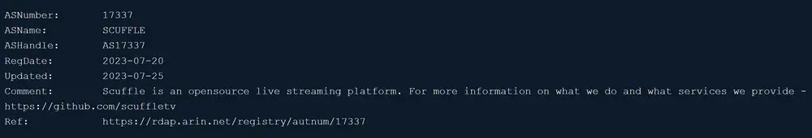
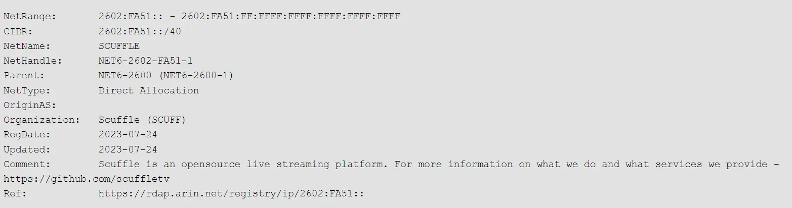
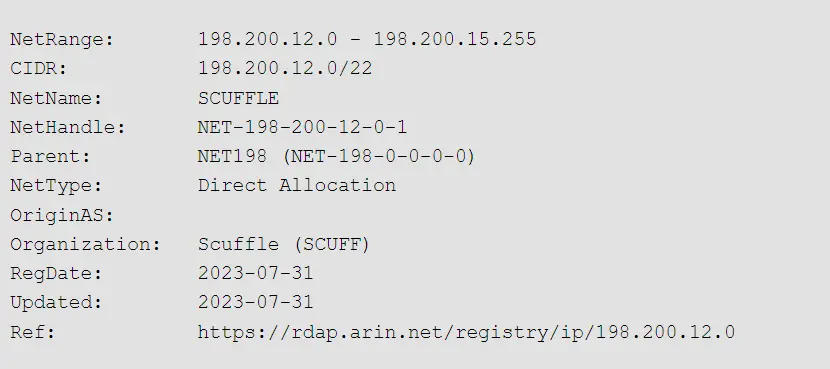

Our recent venture into acquiring IP addresses, while unnecessary at the moment, spurred quite a journey. Despite being a time-consuming process, it seemed practical to embark on it now rather than later. Here's an inside look into our adventure into the IP space acquisition, offering insights into this complex yet fascinating domain.

<!-- truncate -->

## The Benefits of IP Space Ownership

Owning an IP space empowers you to have full control over your servers' communication with the public internet, giving you several advantages over conventionally assigned IPs from a typical cloud provider:

- Owning your own IP subnets means that you retain your IP addresses even when switching between cloud providers or ISPs. This can significantly ease transitions and migrations, as you don't need to reconfigure your IP addressing scheme each time you make a change.
- With your own Autonomous System Number (ASN), you have direct control over how your traffic is routed. This can lead to performance improvements and increased network reliability.
- Owning your own IP subnets allows you to use the same IP addresses in multiple locations globally. This can make it easier to manage and scale your network, and it's how services like Cloudflare and Google provide their widely-available DNS services.
- If your end-users need to whitelist specific IP ranges for firewall or security reasons, owning your own IP subnets can make this process easier.
- With your own ASN, you are visible on the global routing table. This can allow you to establish direct peering relationships with other networks, reducing your dependence on upstream ISPs and potentially improving your network's performance.
- Owning your own IP subnets means that you are responsible for the reputation of those IP addresses. By ensuring that you use your network responsibly and do not violate any rules, you can maintain a high-quality, trustworthy IP reputation.

## The Road to IP Space Acquisition

The journey starts with creating an account with a Regional Internet Registry ([RIR](https://en.wikipedia.org/wiki/Regional_Internet_registry)), which, in our case, was the American Registry for Internet Numbers ([ARIN](https://www.arin.net/)). We needed to establish an [ORG ID](https://www.arin.net/resources/guide/account/records/org/), apply for an Autonomous System Number ([ASN](https://www.arin.net/resources/guide/asn/)), [allocate IPv6 addresses](https://www.arin.net/resources/guide/ipv6/first_request/), and [acquire IPv4 addresses](https://www.arin.net/resources/registry/transfers/preapproval/).

### Setting up an ORG ID

An [ORG ID](https://www.arin.net/resources/guide/account/records/org/) on ARIN essentially represents a company owning internet assets like IP ranges or AS numbers. You start without one, so it needs creating, which requires an array of documents validating your company registration status and ownership proof, plus a non-refundable processing fee of $50. Following approval (approximately 1-2 weeks), you can then apply for an [ASN](https://www.arin.net/resources/guide/asn/), [Transfer Pre Approval](https://www.arin.net/resources/registry/transfers/preapproval/), and [IPv6 Allocation](https://www.arin.net/resources/guide/ipv6/first_request/).

### Understanding the ASN

An Autonomous System Number ([ASN](https://www.arin.net/resources/guide/asn/)) is a unique identifier assigned to a network operating under a single external routing policy on the internet. This identifier is essential for routing data across networks efficiently and for implementing multihoming, which allows you to advertise your IP space over multiple ISPs. Despite talks about "lower" AS numbers or 16bit vs 32bit ASNs, there is no practical difference.

The ASN application requires justification of your network setup requirements. Approval leads to an invoice of approximately $550.

_Our ASN WHO.IS_

### The IPv6 Allocation

Unlike [IPv4](https://www.arin.net/resources/guide/ipv4/waiting_list/), the pool of IPv6 addresses is vast enough that you don't need to purchase subnets from a [third party](https://ipv4.global). Instead, you can request them directly from your RIR, in our case ARIN. The smallest block of IPv6 addresses you can announce is a /48, but for our needs, we requested a /40 block from ARIN.

In terms of IPv6 allocation, you can either request as an [end-user or as an ISP](https://www.arin.net/blog/2023/02/28/ISP-or-end-user). From ARIN's perspective, an ISP is not only the company providing the last-mile connection to end users, but also any company that provides any service to its customers using IP space. This means that even Platform as a Service (PaaS) companies like ours fall into the category of ISP according to ARIN's guidelines.

The concept of a /48 or /40 block might seem abstract, so to give you a practical understanding, let's consider an example: a /48 block provides enough space to create up to 65,536 networks (or subnets). This could be used to organize a vast number of devices within a single data center. With a /40 block like we requested, we can create up to 256 of these /48 networks, each potentially corresponding to different datacenters or subdivisions within our organization. This gives us significant flexibility for growth and organization of our services.

As with the ASN, you will need to justify why you need the size block you request by explaining how you plan to implement your network setup. Once ARIN approves your request, you will be asked to pay a fee. For us, this fee was $250.

_Our IPv4 Range WHO.IS_

### The Path to IPv4 Addresses

Acquiring IPv4 addresses is trickier due to [ARIN's IPv4 address pool depletion](https://www.arin.net/vault/resources/request/ipv4_depletion.html). Either apply to be on the IPv4 waitlist or request pre-approval for purchase from a third party at a premium. We opted for the latter due to the [waitlist's length](https://www.arin.net/resources/guide/ipv4/waiting_list/) and the constant demand for IPs.

#### Navigating Transfer Pre-Approval

A [transfer pre-approval](https://www.arin.net/resources/registry/transfers/preapproval/) facilitates either ASN or IPv4 transfers. For IPv4 addresses, you need to choose a subnet size to apply for. On the public internet, the smallest announceable block is a /24, which equates to 256 IPs. This minimum size means even if you want a single server in two datacenters with unique IPs, you need two /24 blocks. We requested a /22, giving us four /24 blocks and room for expansion.

#### Purchasing IPv4 Addresses

Though there are limited brokers for IPv4 addresses, our experience with [ipv4.global](https://ipv4.global) was excellent - friendly, efficient, and smooth. Following payment, the IP addresses were allocated within a week with an updated [WHO.IS](https://dnschecker.org/ip-whois-lookup.php?query=198.200.12.0). The cost per IP to the broker was $35/IP in our case. There was also an additional cost for transfer fee to ARIN of $375.

_Our IPv6 Range WHO.IS_

### Timeline

Our journey through IP space acquisition started on the 4th of July with the application for an ORG ID, followed by a request for an ASN, an IPv6 /40 block, and culminating with the purchase of a /22 IPv4 block. The entire process, from start to finish, spanned a month and cost $37,065 in total.

This complex yet rewarding process not only gave us control over our own corner of the internet but also a deep understanding of the world of internet numbers. While intricate, the benefits of having your own IP space, especially if you're planning for substantial growth, are considerable. We are now better prepared for our future networking endeavors and ready to cater to our users' needs more effectively.
